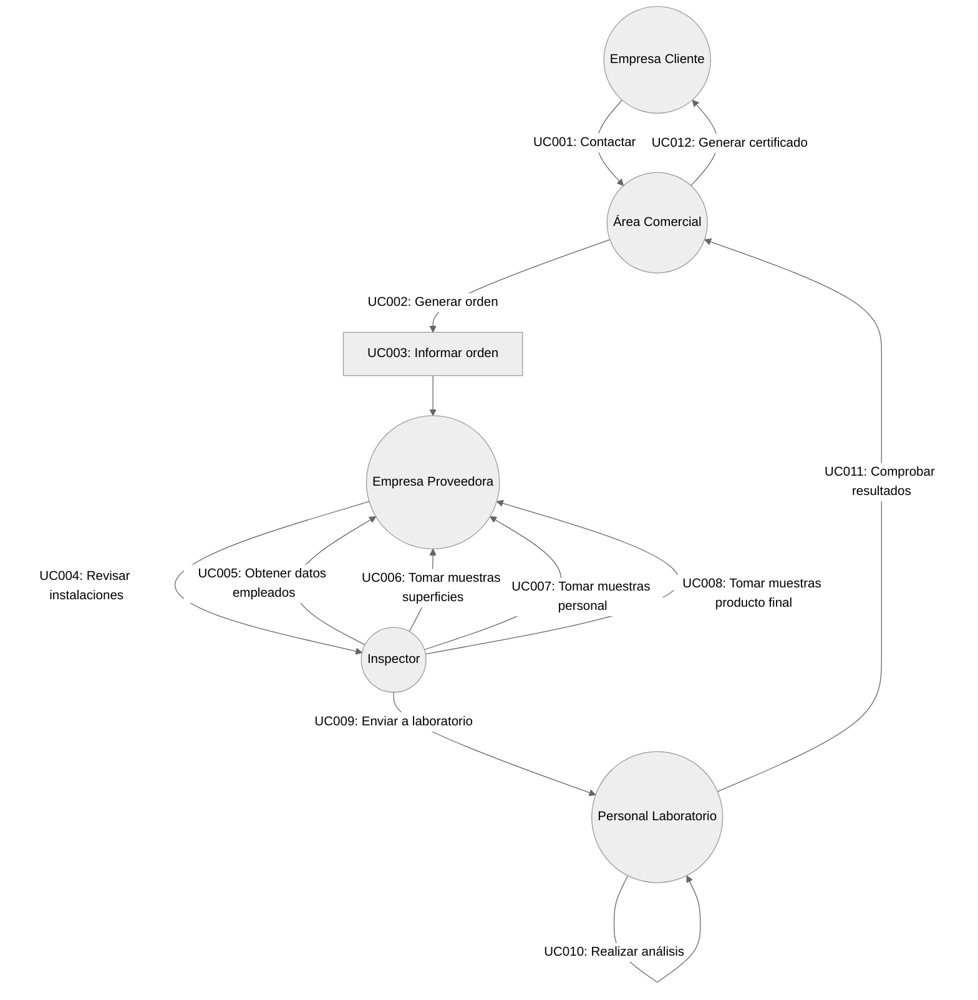
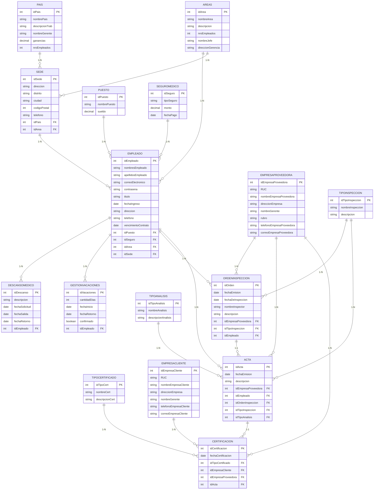
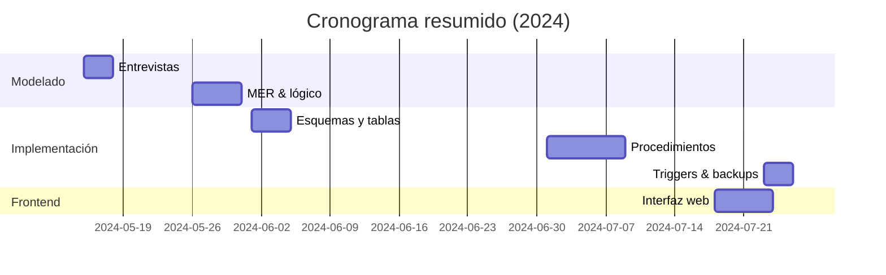

# 📁 Proyecto 
**Escuela Profesional de Ingeniería de Sistemas e Informática**  
**Tipo:** Proyecto grupal académico  
---

## 🎯 Objetivo del Proyecto

Diseñar, modelar e implementar una base de datos relacional para la gestión de inspecciones, certificaciones y recursos humanos de una empresa multinacional de servicios de calidad, además de construir un pequeño sistema web que permita interactuar con dicha base de datos. 
Representando los conocimientos adquieridos en base de datos.

---

## 🧱 Tecnologías Utilizadas
| Capa | Tecnología |
|------|------------|
| Base de datos | Microsoft SQL Server 2019 |
| Modelado | Herramientas CASE (SSMS, Draw.io) |
| Back-end | Procedimientos almacenados, funciones escalares y tabla, triggers |
| Front-end | HTML5 + CSS3 + JavaScript (interfaz mínima) |
| Utilidades | SSIS (exportación a Excel), SQL Server Agent (backups) |

---

## 🗺️ Diagramas & Modelos

## 📊 Diagrama de Casos de Uso del Negocio
En caso de querer visualizar de mejor manera los diagramas que se planteo puede acceder a la sección demominada 'Documentation' en este mismo repositorio.
[📄 Archivo PDF con los casos de uso](Documentation/DiagramasCasoDeUsoUML-12-14-uml.pdf)

## 🧱 Modelo Lógico (ER)
Para mas detalles acceda al apartado en 'Documentation' donde se podrá visualizar tanto el Modelo lógico, conceptual y modelo físico de la base de datos.
[📄 Archivo PDF Modelos de la base de datos](Documentation/ModeloConceptual-ModeloLógico-ModeloFísico-BasedeDatos.pdf)

---

## 🧮 Procedimientos & Funciones Destacados

| Objeto | Tipo | Propósito |
|--------|------|-----------|
| `usp_llenar_acta` | PA | Crear acta a partir de una orden de inspección |
| `usp_llenar_certificado` | PA | Emitir certificado ligado a acta y cliente |
| `usp_actualizar_empleado` | PA | Actualizar datos de empleado y mantener consistencia de contadores por país/área |
| `fne_SueldoNeto` | Escalar | Calcular sueldo final (descuentos AFP, seguro) |
| `fnt_empleados_descanso` | Tabla | Listar empleados actualmente con descanso médico |

Para visualización con mas detalle:
[📄 Archivo PDF Procedimientos y funciones utilizados](Documentation/Procedimientos-y-funciones.pdf)

---

## 🔄 Triggers de Auditoría

| Trigger | Tabla | Evento | Acción |
|---------|--------|--------|--------|
| `tr_empleadoInsertado` | rrhh.Empleado | INSERT | Registro en `historial_empleado` |
| `tr_empleadoModificado` | rrhh.Empleado | UPDATE | Idem + fecha/hora |
| `tr_empleadoEliminado` | rrhh.Empleado | DELETE | Idem + usuario |

Para visualización con mas detalle:
[📄 Archivo PDF Triggers de Auditoría](Documentation/Triggers.pdf)

---

## 💾 Backups Automáticos
- **Frecuencia:** Diaria 00:00 hrs  
- **Destinos:** Disco local `D:\backups\` + carpeta secundaria `C:\respaldo\`  
- **Técnica:** Job SQL Server Agent con formato `.bak` y timestamp.  
Para visualización con mas detalle:
[📄 Archivo PDF Backups](Documentation/CreaciónBackup.pdf)
---

## 📊 Exportación a Excel
Flujo SSIS que replica la tabla `cmcl.Certificacion` a archivo `.xlsx` para reportes gerenciales.  
*Origen:* OLE DB SQL Server  
*Destino:* Excel 2016+ (xlsx)  
Para visualización con mas detalle:
[📄 Archivo PDF Transferencia de certificaciones a Excel](Documentation/Transferencia-de-tabla-certificaciones-a-Excel.pdf)

---

## 🧪 Calendario de Tareas

## Consideraciones Finales
En caso de querer utilizar la base de datos puede restaurar la base de datos puede ingresar directamente a la carpeta 'Backup' del respositorio para poder realizarlo con Microsoft SQL Server 2019. El archivo esta disponible como [Backup](Backup)
