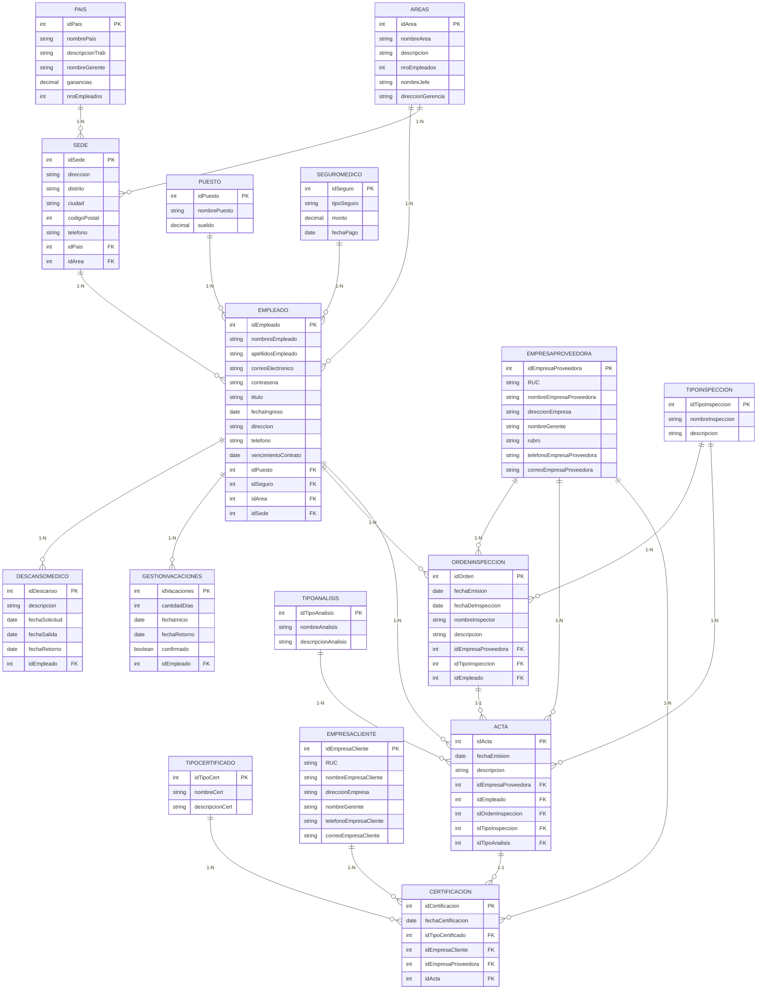

# 📁 Proyecto 
**Escuela Profesional de Ingeniería de Sistemas e Informática**  
**Tipo:** Proyecto grupal académico  
---

## 🎯 Objetivo del Proyecto
Diseñar, modelar e implementar una base de datos relacional para la gestión de inspecciones, certificaciones y recursos humanos de una empresa multinacional de servicios de calidad, además de construir un pequeño sistema web que permita interactuar con dicha base de datos.

---

## 🧱 Tecnologías Utilizadas
| Capa | Tecnología |
|------|------------|
| Base de datos | Microsoft SQL Server 2019 |
| Modelado | Herramientas CASE (SSMS, Draw.io) |
| Back-end | Procedimientos almacenados, funciones escalares y tabla, triggers |
| Front-end | HTML5 + CSS3 + JavaScript (interfaz mínima) |
| Utilidades | SSIS (exportación a Excel), SQL Server Agent (backups) |

---

## 🗺️ Diagramas & Modelos

Para poder visualizar de mejor manera los diagramas


## 🧱 Modelo Lógico (ER)



---

## 🧮 Procedimientos & Funciones Destacados

| Objeto | Tipo | Propósito |
|--------|------|-----------|
| `usp_llenar_acta` | PA | Crear acta a partir de una orden de inspección |
| `usp_llenar_certificado` | PA | Emitir certificado ligado a acta y cliente |
| `usp_actualizar_empleado` | PA | Actualizar datos de empleado y mantener consistencia de contadores por país/área |
| `fne_SueldoNeto` | Escalar | Calcular sueldo final (descuentos AFP, seguro) |
| `fnt_empleados_descanso` | Tabla | Listar empleados actualmente con descanso médico |

&gt; Todos los objetos están versionados en `/sql/store/` con prefijo `usp_` (procedimientos) y `fn_` (funciones).

---

## 🔄 Triggers de Auditoría

| Trigger | Tabla | Evento | Acción |
|---------|--------|--------|--------|
| `tr_empleadoInsertado` | rrhh.Empleado | INSERT | Registro en `historial_empleado` |
| `tr_empleadoModificado` | rrhh.Empleado | UPDATE | Idem + fecha/hora |
| `tr_empleadoEliminado` | rrhh.Empleado | DELETE | Idem + usuario |

---

## 💾 Backups Automáticos
- **Frecuencia:** Diaria 00:00 hrs  
- **Destinos:** Disco local `D:\backups\` + carpeta secundaria `C:\respaldo\`  
- **Técnica:** Job SQL Server Agent con formato `.bak` y timestamp.  
*Configuración:* `docs/fig92_job_backup.png`

---

## 📊 Exportación a Excel
Flujo SSIS que replica la tabla `cmcl.Certificacion` a archivo `.xlsx` para reportes gerenciales.  
*Origen:* OLE DB SQL Server  
*Destino:* Excel 2016+ (xlsx)  
*Vista:* `docs/fig94_95_ssis.png`

---

## 🧪 Calendario de Tareas
```mermaid
gantt
  title Cronograma resumido (2022)
  dateFormat YYYY-MM-DD
  section Modelado
  Entrevistas           :2022-05-15, 3d
  MER & lógico          :2022-05-26, 5d
  section Implementación
  Esquemas y tablas     :2022-06-01, 4d
  Procedimientos        :2022-07-01, 8d
  Triggers & backups    :2022-07-23, 3d
  section Frontend
  Interfaz web          :2022-07-18, 6d
